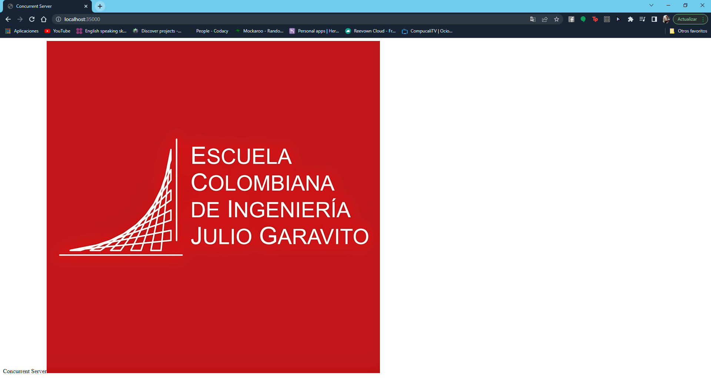

# Concurrent Server Web
En este proyecto se realizara una calculadora con la media y la desviación estandar implementando la linkedList. 

## Requerimientos 

1. Cree un versión concurrente de su servidor web

2. Use pools de hilos para una implementación optima.

3. Cree pruebas concurrentes para probar su servidor web.

4. (Opcional) Incluya manejo de cookies, e intente simular varios usuarios (https://docs.oracle.com/javase/tutorial/networking/TOC.html)

5. Entregue de manera profesional sobre github.

## Autor

Natalia Orjuela
Estudiante de ingeniería de sistemas

## Pre-Requisitos

* Maven
* Git
* Java

## Compilar Proyecto
~~~
mvn package
~~~

## Ejecutar Proyecto

## Ejecutar pruebas

~~~
mvn test
~~~

## Documentación

~~~
mvn javadoc:javadoc
~~~

## Licencia
Este proyecto está bajo la Licencia Pública General GNU - consulte el archivo de [LICENCIA]("C:\Users\Natalia\Documentos\ARSW\LABS-ARSW\Concurrent Server\LICENSE.txt") para obtener más detalles